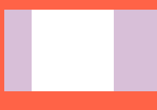

* [노마드코더 - 코코아톡 클론코딩](https://nomadcoders.co/kokoa-clone/lobby)

<br/>

> ## 강의를 듣게된 이유.
**사실 이 강의는 듣지 않으려 했었다.. 코딩애플에서도 유료결제해서 기초 HTML, CSS 강의를 들었기 때문에!**
**리액트 트위터 클론코딩하려는데 트위터 디자인을 보고.. 아 나는 저걸 만드는데 얼마나 걸리고 예쁘게 짤 수 있을까? 라는**
**생각이 들어 큰 맘 먹고 바로결제.. 할부로 하하 유료인만큼 더 열심히 완전 정복해서 챌린지 까지 도전 해보자!**

**기초 강의로 대부분 아는 내용으로 빠르게 수강 하였음.** 

# 노트
## 1. 강의 #1.1 ~ #1.9 
* #### 구글크롬, VS Code, Github Desktop 설치 (그래도.. 개발자이긴하니 다 설치가 되있긴 했다.)
* #### 큰 내용 웹 사이트를 만드는 언어 - HTML(content) & CSS(디자인) & Javascript(기능동작)

<br />

## 2. 강의 #2.0 ~ #2.11
* 폴더명, 파일명은 항상 소문자로 생성 해야한다.
* `VSC` 확장 프로그램 설치
1. Community Material Theme 
2. Material Icon Theme
3. prettier 설치
> **prettier 설정**
ㅤ`ctrl + ,` 설정에서 `editor` 검색 -> `Format On Save` 체크
### 태그 참조 [HTML elements reference](https://developer.mozilla.org/en-US/docs/Web/HTML/Element)

## 3. 강의 #3.0 ~ #3.19
* CSS - Cascading Style Sheet(CSS) 위에 있는 코드 부터 차례로 적용.
### block(box) <-> inline 
* 옆에 다른 요소가 올 수 없는 걸 `block`, 올 수 있는 건 `inline` 이라 한다. 
* 어떤 요소가 `inline`이면 높이와 너비를 가질 수 없다.
* `inline`은 높이가 없으므로 상 하 margin 적용이 안된다. 
  
### user agent stylesheet
* 브라우저가 기본적으로 style 속성 지정
### margin 
* box의 border(경계)로부터 `바깥`에 있는 공간 `margin: 0 0 0 0` 상 우 하 좌(시계방향)
* Collapsing margins
  아래 사진에서 흰 box의 경계가 보라색 box의 경계와 같을 때 일어남 
  그 때 두 box의 margin은 하나가 된다. 위 아래 쪽만 발생
  
<br/>

### padding
* box의 border(경계)로부터 `안쪽`에 있는 공간 `margin: 0 0 0 0` 상 우 하 좌(시계방향)
### border
* inline, block 모두 적용 가능 `border: 2px solid black;` (두께 선종류 색상)

### inline-box
* 박스를 나란히 두기 위해 사용하나 실제로는 문제가 많아 사용하지 말고 flex 사용하자!
### flexbox 
> 3개의 규칙
1. 자식 엘리먼트에는 어떤 것도 적지 말야아 된다. 부모 엘리먼트에만 명시
2. `justify-content`는 주축(main axis)에 적용 `align-items`는 교차축(cross axis)에 적용 [참조](https://developer.mozilla.org/ko/docs/Web/CSS/CSS_Flexible_Box_Layout/Basic_Concepts_of_Flexbox)
  
<br/>

### position
1. relative - element가 '처음 생성된 위치'를 기준점으로, top bottom left right으로 위치를 조금씩 수정할 수 있다.
2. absolute - 가장 가까운 relative 부모를 기준으로 이동 position:relative; 를 해주면 부모가 된다. 없으면 body.

### combinator
1. `div span {...}` div 밑의 span
2. `div > span {...}` div 바로 밑의 자식인 span
3. `p + span {...}` p의 바로 옆의 형제 span 
4. `p ~ span {...}` p의 옆의 형제 span 

### attribute selector(MDN 참조)
### custom properties(MDN 참조)

<br/>

- [HTMLCSS](/posts/HTMLCSS)
  
```toc

```
