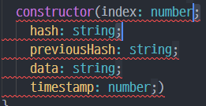

># VS Code 정리

<br/>

>## 단축키 정리
### 0. 키보드 단축키 모음을 확인
> ctrl + k + s
* 키보드 단축키 설정 파일 오픈

<br/>

### 1. ctrl + d 
* *영역 선택 후 다중 선택*
> 예시 
  public index: number ```;``` 선택 후 ctrl + d 
<p class="alignleft"></p>

<div style="clear:both;"/>

### 2. 빈줄 생성
> ctrl + shift + enter
* 행 위에 빈줄 생성
> ctrl + enter 
* 행 아래 빈줄 생성
  
### 3. 열 선택
> alt + 마우스 왼쪽 클릭
* 해당 라인 커서 생성
> 영역 선택 alt + shift + i 
* 선택 영역 끝에 커서 생성
> alt + shif + 드래그
* 마우스 드래그로 열 선택

<br/>

* [VSCode](/posts/VSCode)

```toc

```
