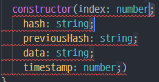

># VS Code 정리

<br/>

>## 단축키 정리
### 1. ctrl +d 
* *영역 선택 후 다중 선택*
> 예시 
  public index: number ```;``` 선택 후 ctrl + d 
<p class="alignleft"></p>

<div style="clear:both;"/>

* [VSCode](/posts/VSCode)
  
```toc

```
